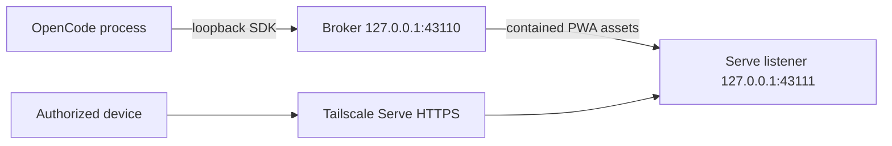

# OpenCode Dispatch Plugin

`opencode-dispatch-plugin` is an independent, community-maintained OpenCode plugin that provides a narrow mobile control surface for explicitly enabled live sessions. It is not affiliated with, endorsed by, or supported by OpenCode or its maintainers.

The plugin is designed for private Tailscale Serve access. It keeps the broker and OpenCode upstreams on loopback, requires Tailscale identity plus the `opencode-dispatch-plugin/cap/control` capability for every remote request, and exposes only documented session actions.

## Before You Start

- OpenCode `>=1.18.3 <2`
- Tailscale `>=1.92` for remote access
- MagicDNS and Tailscale HTTPS enabled for the tailnet
- A least-privilege Tailscale grant for each person who may control the plugin

OpenCode is not sandboxed. A remotely submitted prompt or approval acts with the local OpenCode user's authority. Use a dedicated OS user, VM, or container when that authority is too broad.

## Install

Install the published package with OpenCode's global plugin command:

```sh
opencode plugin -g opencode-dispatch-plugin
```

Restart OpenCode after installation. Open a live session, then run `/dispatch` and select **Enable current session**. The command shows setup, status, QR, copy-link, and privacy-safe diagnostics options. It never installs Tailscale, signs in, starts Serve, or runs shell commands on your behalf.

See [Installation](docs/INSTALL.md) for an isolated setup and [Tailscale](docs/TAILSCALE.md) for the required transport configuration.

## What Remote Users Can Do

An authorized device can list enabled sessions, read an authoritative snapshot, messages, status, and todos, submit a bounded text prompt, abort work, answer a pending question, or decide a pending permission once or reject it. Every remote mutation is bound to the current live OpenCode process.

The plugin does not expose a terminal, PTY, shell, file browser, provider credentials, configuration, raw OpenCode proxy, session management, persistent permission grants, or an `always` approval option.

## Privacy And Support

The plugin does not persist prompts, transcripts, model or tool output, permission bodies, question bodies, or raw OpenCode responses. It has no hidden telemetry. API and session data are network-only and use `no-store` semantics.

This project is released under the [MIT License](LICENSE). MIT permits commercial use and makes no promise that operating the service is free. Tailscale, hosting, device, and network costs remain the operator's responsibility.

Read [Security](SECURITY.md), the [threat model](THREAT_MODEL.md), [operations](docs/OPERATIONS.md), and [troubleshooting](docs/TROUBLESHOOTING.md) before exposing a session.

## Architecture



Tailscale reachability alone is not authorization. The Serve boundary supplies identity and the required app capability for each request. Direct requests and spoofed Tailscale headers fail closed.

## Release Status

The package release workflow publishes only from a protected `v*` tag through the protected `npm` environment using npm trusted publishing and provenance. Pull requests never publish packages. See [Contributing](CONTRIBUTING.md) and [CHANGELOG.md](CHANGELOG.md).
